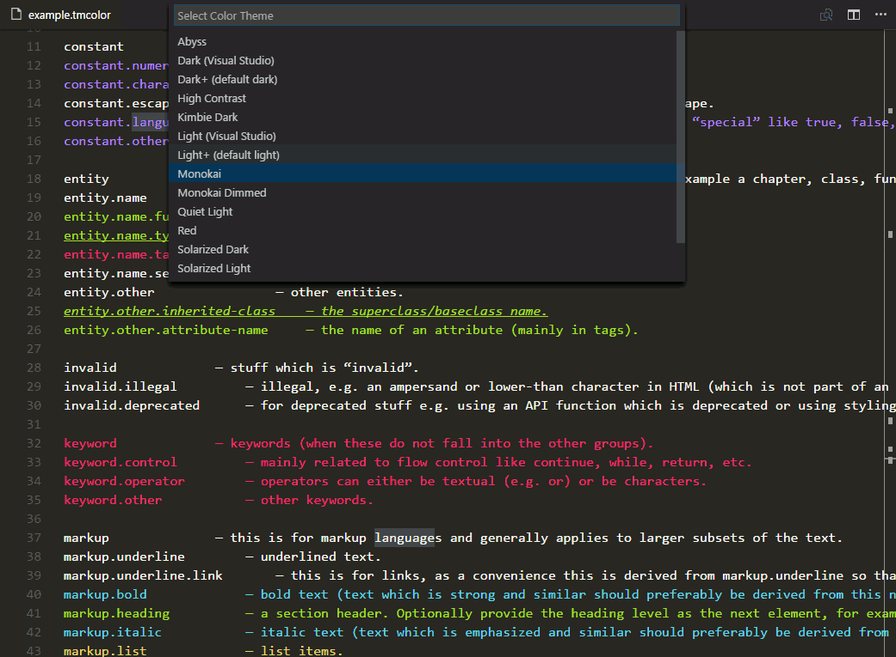

# TextMate Grammar Color Demo 

This extension creates colorization syntax for the file extension *.tmcolor to show how theme colors map to the TextMate naming conventions. 

It can be useful for:
- Authoring Visual Studio Code themes
- Authoring TextMate syntax colorizers
- Choosing a Visual Studio theme

Please navigate to your VS Code extension folder and open the */extensions/tmColor/demo/example.tmcolor* file.
E.g.:
- C:\Users\user\\.vscode\extensions\tmcolor\demo\example.tmcolor

